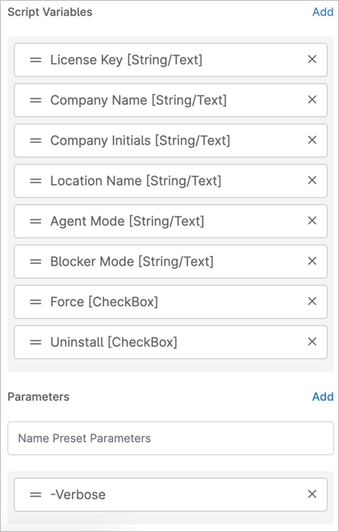

# Deploy or Remove CyberFox AutoElevate Agent
A basic PowerShell script that uses parameters, Script Variables, or Custom Fields to deploy the [AutoElevate](https://autoelevate.com/) agent from CyberFox using the parameters you define as documented in their support system at: [https://support.cyberfox.com/115000883892-New-to-AutoElevate-START-HERE/115003703811-System-Agent-Installation?from_search=141643848](https://support.cyberfox.com/115000883892-New-to-AutoElevate-START-HERE/115003703811-System-Agent-Installation?from_search=141643848)

See comments at top of script for documentation and CONFIG section to make any adjustments. Create Custom Fields with the provided (customizable) field names and Automation Read permission in NinjaRMM if you want to use custom fields for some or all values (recommended for at least license key; this could be changed to a Documentation Custom Field pretty easily but is NOT currently, it's just a regular one.

The `-Uninstall` parameter is provided to uninstall the agent if it already exists, and the `-Force` parameter will attempt (re) installation if the service already exists (with out this, it will quit if it finds the agent service to already exist!).

## Download Location
The hardcoded download location in the script is the agent installer URL as provided by CyberFox directly, and they maintain it with the current version of the installer at the provided URL. You are welcome to edit the CONFIG section variable $URL to your own hosted version if you prefer for security or convenience reasons.

## Script Parameters
The Script Parameters in NinjaRMM might look something like this (alternately, use parameters and/or custom fields only):

Version 0.0.2 is the first public release. Thanks to @itnorm on Discord for the inspiration to put this together!