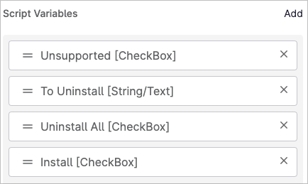

# Manage Visual C++ Redistributables in Windows
Uninstalls or installs Visual C++ Redistributables in various ways. Uses the [VcRedist](https://vcredist.com/quick/) PowerShell module from the NuGet, and installs the module and an updated Package Manager (to use NuGet at all) if required first.

- Call with NO arguments/parameters to output a list of the currently installed VC++ Redistributables on the system, but do nothing.
- Call with `-Unsupported` to uninstall all unsupported versions of the Redistributable (2012 and older).
- Call with `-ToUninstall` and one or more years, separated by comma (no spaces), to uninstall specific versions of the Redistributable.
- Call with `-UninstallAll` to uninstall all versions of the Redistributable (all versions installed on the whole system, of any type!).
- Call with `-Install` to install all SUPPORTED versions of the Redistributable (2013 and newer).

Can mix and match `-Install` and the other options together; supported versions will be installed after the uninstallations are completed.

## EXAMPLES
`script.ps1 -ToUninstall "2005,2010”`
Remove all versions of Visual C++ Redistributable 2005 and 2010.

`script.ps1 -UninstallAll -Install`
Uninstall all versions of Visual C++ Redistributable, then install all supported versions. This can be quite handy to make sure only the latest patch version is installed, as the specific minor version is often outdated or multiple are installed, and this will ensure only the latest version of only the supported VC++ Redistributable releases are installed.

### NOTE
Some software may stop working properly if VC++ Redistributables are not installed that match their needed version! If you run into 
issues with apps after cleaning up, you may need to reinstall the app (which often reinstalls the VC++ Redistributable it came with), or 
install the VC++ Redistributable version manually if it's unsupported. This script can be modified to install other versions, either all 
versions including unsupported by changing this line: 

`$Redists = Get-VcList | Save-VcRedist -Path $Path | Install-VcRedist -Silent`

to be like this with added `-ExportAll` parameter:

`$Redists = Get-VcList -Export All | Save-VcRedist -Path $Path | Install-VcRedist -Silent`

Or, you can filter the output using Where-Object per the Examples at [https://vcredist.com/get-vclist/#examples](https://vcredist.com/get-vclist/#examples) in order to install only specific versions or architectures. This may be added to this script in a later release, to control which versions to install besides none or "all supported" as it started just removing old versions and the install-supported was added after the fact.

## NinjaOne
This script works with parameters, or via Script Variables with these types and names, none of which are required:
[Checkbox] Unsupported
[String/Text] ToUninstall
[Checkbox] UninstallAll
[Checkbox] Install

Your configuration may look something like this for the above:

## VC++ Version Note
The Install command installs VC++ 2012 in addition to the newer ones. However, `-Unsupported` removes up through 2012. My script removes it because it left Microsoft support in January 2023 per [https://learn.microsoft.com/en-us/lifecycle/products/visual-studio-2012](https://learn.microsoft.com/en-us/lifecycle/products/visual-studio-2012) but the PowerShell module [VcRedist](https://vcredist.com/versions/ "VcRedist Included Redistributables Version List") still counts it as a current version as of Nov. 30, 2023. Which is probably fine, but you should be aware of the discrepancy.
