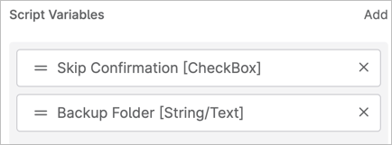

# Extend-WinRE-RecoveryPartition-CustomField.ps1
Unmodified Source: [https://learn.microsoft.com/en-us/windows-hardware/manufacture/desktop/add-update-to-winre?view=windows-11#extend-the-windows-re-partition](https://learn.microsoft.com/en-us/windows-hardware/manufacture/desktop/add-update-to-winre?view=windows-11#extend-the-windows-re-partition)

To assist with resolution of failed install error status 0x80070643 for Microsoft KB5034441
[https://support.microsoft.com/kb/5034441](https://support.microsoft.com/kb/5034441)

**NOTE: Version 0.0.2** released on 2024-02-20 on the NinjaOne Discord which adds support for outputting to Custom Fields for later filtering.

**NOTE: Version 0.0.3** released on 2024-03-21 down below at [https://github.com/dszp/NinjaOne-Scripts/tree/main/Microsoft-Updates/Extend%20WinRE%20Recovery%20Partition%20KB5034441](https://github.com/dszp/NinjaOne-Scripts/tree/main/Microsoft-Updates/Extend%20WinRE%20Recovery%20Partition%20KB5034441) which also adds some nice logging changes contributed by Olrik Lenstra (Discord user artellos)!

### MICROSOFT DESCRIPTION:
The sample script below can be used to increase the size of recovery partition to enable successfully update Windows Recovery Environment (WinRE). Updates to WinRE require at minimum 250MB of free space in the 
recovery partition to install successfully. On devices that may not have adequate free space in the recovery partition, the sample script below can be used to extend the recovery partition.

Reboot your machine before you run the script. This is critical as there may be pending partition operations staged on your machine that will need to be finalized before the script can safely increase the WinRE partition size. After your machine reboots open PowerShell as admin and run 

`mkdir ~<path to new backup directory>~ `

to create a backup directory that the script may use in case of failure to restore the original partition. Note the location of this backup directory as the script will ask for your backup path.

## Version 0.0.1 on 2024-02-10
MODIFIED/ADDED by David Szpunar on 2024-02-10 v0.0.1:
 
Default the Backup folder to `$env:temp\ExtendWinREBackup` and create the folder if it doesn't exist.

Run with the `-SkipConfirmation` switch to perform the recommended changes, otherwise READ ONLY proposed output only by default!

You can create Ninja Script Variables for `SkipConfirmation` (checkbox) and `BackupFolder` (text box) and they will work (see example image below).

Example output in read-only mode from a system that needs its partition expanded:

```
In write-mode, would create backup folder C:\Windows\TEMP\ExtendWinREBackup as it does not exist.
Start time: 02/10/2024 21:12:57
Examining the system...
Windows RE status:         Enabled
Windows RE location:       \\?\GLOBALROOT\device\harddisk1\partition4\Recovery\WindowsRE
System directory: C:\Windows\system32
ReAgent xml: C:\Windows\system32\Recovery\ReAgent.xml


Collecting OS and WinRE partition info...
OS Disk: 1
OS Partition: 3
WinRE Partition: 4
Disk PartitionStyle: GPT
WinRE partition size info
  Partition capacity: 532672512
  Partition free space: 60162048
WinRE Partition Offset: 127502647296
WinRE Partition Type: Recovery
OS partition size: 127379963904
OS partition Offset: 122683392
OS partition ends at: 127502647296
WinRE partition starts at: 127502647296


Verifying if the WinRE partition needs to be extended or not...


Summary of proposed changes
Will shrink OS partition by 262144000
  Current OS partition size: 127379963904
  Target OS partition size after shrinking: 127117819904
Unallocated space between OS and WinRE partition that will be used towards the new WinRE partition: 0
Will extend WinRE partition size by 250MB
  WinRE partition: Disk [1] Partition [4]
  Current WinRE partition size: 532672512
  New WinRE partition size:     794816512
WinRE will be temporarily disabled before extending the WinRE partition and enabled automatically in the end

Please reboot the device before running this script to ensure any pending partition actions are finalized

REPORT-ONLY mode, must rerun with -SkipConfirmation flag to proceed with changes. Quitting.
```

## Version 0.0.2 on 2024-02-20
ADDED by David Szpunar on 2024-02-20 v0.0.2:
- Added custom field support to output last run full results, last-line results, or both, if custom fields are defined in CONFIG section below.
- Custom Field Recommended Device Filters:
- "Devices Failing MS KB5034441 WinRE Expansion - After Script" - Devices with failed OS patch where the Last Result custom field contains "REPORT-ONLY"
- "Devices Failing MS KB5034441 WinRE Expansion - NEEDS SCRIPT RUN" - Devices with failed OS patch where the Last Result custom field equals "Doesn't Exist"
- "Devices Failing MS KB5034441 WinRE Expansion - SUCCESS, NEEDS PATCH" - Devices with failed OS patch where the Last Result custom field contains any 
- of "Successfully completed the operation" or "More than 250 MB of free space was detected" and Status is "Up" (these devices you should be able to 
- attempt to re-apply the patch for KB5034441 and it should now succeed).
- There may be other useful filters, but these are the ones I've created and used in my testing. Note that currently these filters match on any failed OS 
- patch, NOT just KB5034441, but you may be able to customize the filters further.

## Version 0.0.3 on 2024-03-21
ADDED by David Szpunar on 2024-03-21 v0.0.3:

Updated with recommended minor changes from Discord user artellos (Olrik Lenstra) from the NinjaOne Discord at:
[https://discord.com/channels/676451788395642880/1206063878564352081/1217215431102697593](https://discord.com/channels/676451788395642880/1206063878564352081/1217215431102697593)

and

[https://discord.com/channels/676451788395642880/1206063878564352081/1217222521779261572](https://discord.com/channels/676451788395642880/1206063878564352081/1217222521779261572)

These changes avoid backups if just checking and not also attempting to make changes, and adjust some logging messages to be more clear in filtering results.

Search the output field for the word "RERUN" to determine which devices may need to have the script re-run to confirm they are fixed.

Thanks for these changes! The full notes provided with the changes are here, describing the updates to logging outputs, primarily:

## Detailed rundown of updates made in 0.0.3 from Olrik Lenstra (artellos on Discord):

Just a few pointers from me as improvements to the script that I found while testing this out myself and preparing it for "prime time" for our environment. 🙂
I hope you don't mind 🫣

### Creating the Backup Folder
I did a dry-run (without SkipConfirmation checked) and it still created the backup folder. On line 239/240 it starts looking at the backup folder parameter but it never checks the SkipConfirmation if it really should create that folder or not 😉

My suggestion would be to change line 240 to:
`if ($PSBoundParameters.ContainsKey('BackupFolder') -And $SkipConfirmation)`

and change line 285 to:
```
} else {
    LogMessage("READ ONLY: Backup Folder will not be checked or created in read only mode.")
}
```

That way it will log to the script output that it won't create the folder when the SkipConfirmation is false. 💪

### Adding some formatting
Personally, I like some extra formatting in the script so that when you do have to read it back it's easier to spot the important bits.

I would add another log message underneath line 384:
`LogMessage("===========================")`

### No changes needed?
I also ran this script on my device that has more than enough room available in the WinRE partition (500MB or something).

Aside from that, my OS (Win11 23H2) doesn't need a fix because MS actually fixed it properly from Win11 22H2 and onwards 🙂

My advice would be to add at least the following code after line 164:
```
# Check if the script is required to make any adjustments.

if (get-hotfix -Id KB5034441 -ErrorAction Ignore ) {
    # Hotfix already installed and should be skipped.
    LogMessage("PATCHED: This system is already patched and doesn't need any action. Quitting.")
    exit 0
} elseif ([System.Environment]::OSVersion.Version.Build -gt 22621) {
    # Win11 22H2 and above - These are fully automated and fixed and should not be fixed in this script.
    LogMessage("PATCHED: This system runs Win11 22H2 or higher and doesn't require this fix. Quitting.")
    exit 0
} else {
    # No conditions detected that make this script unnecessary.
    LogMessage("No conditions detected that make this script unnecessary. Continuing with other checks.")
}
```

### Change Logging
Perhaps it would be more "in line"  with the rest of the logging if line 440 would be changed to this:
`LogMessage("WRITE MODE: SkipConfirmation Parameter set to TRUE")`

## Script Variables
NinjaRMM Script Variables example:


# Extend-WinRE-RecoveryPartition-NoCustomFields.ps1
This script removes the pause and instead adds the `-SkipConfirmation` flag to fully process (or read-only output if not provided) to the _original_ script from Microsoft. There are no fancy changes here per the above, just the automation, provided for reference. You an also just use the above script and comment out the Ninja custom field definitions to use the updated script without NinjaRMM!
